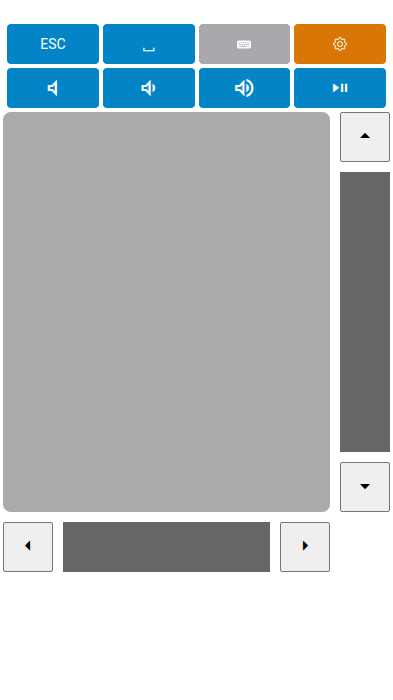

# Simple Remote



Remote control your PC from your phone. Uses

- Go with [go-socket.io](https://github.com/googollee/go-socket.io)	and [robotgo](https://github.com/go-vgo/robotgo)
- AlpineJS with [Shoelace Webcomponents](https://shoelace.style/)

## Building

- Download and install GO
- Install go-socket.io and robotgo according to instructions 
- run with `go run main.go`

On Windows the mouse cursor might disappear e.g. after the PC has awaken from sleep. In this case you can disable cursor suppression by setting the registry value

```
HKEY_LOCAL_MACHINE\SOFTWARE\Microsoft\Windows\CurrentVersion\Policies\System
EnableCursorSuppression = 0
```

and restart the PC.
